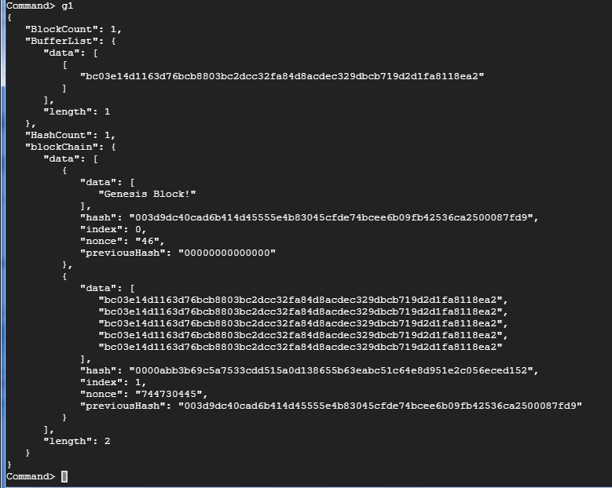
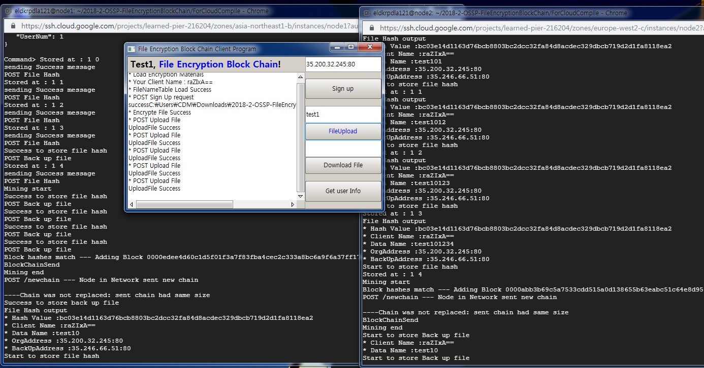
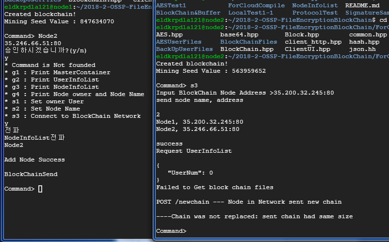
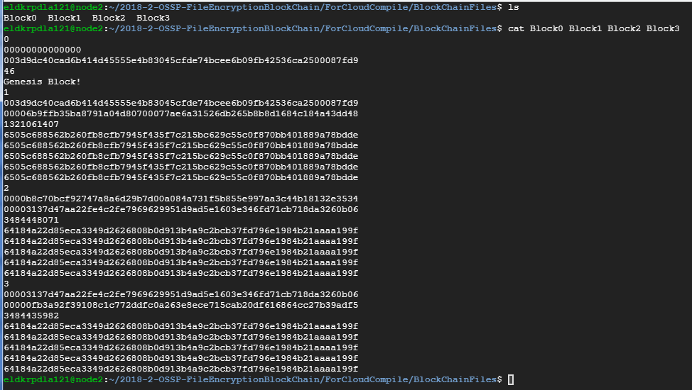
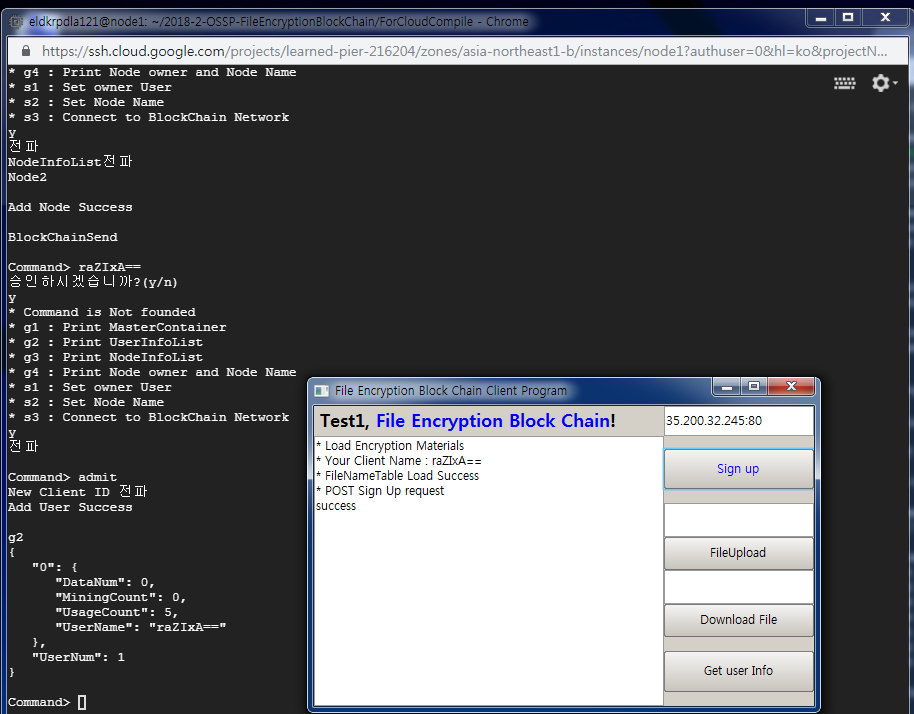
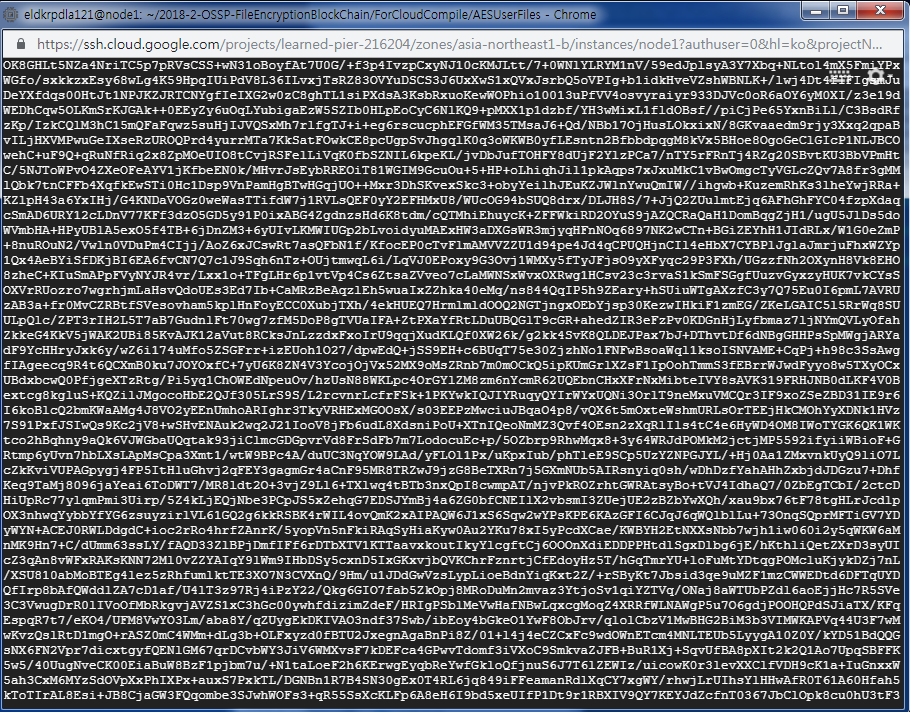
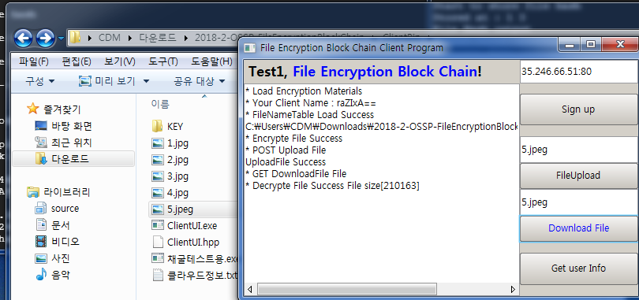
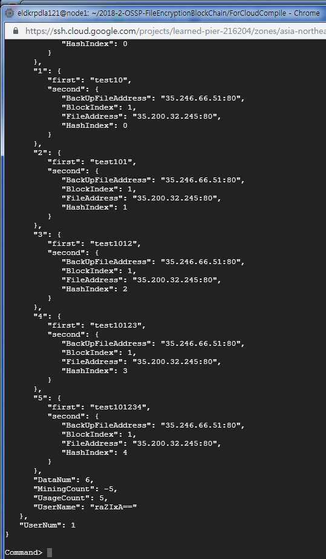
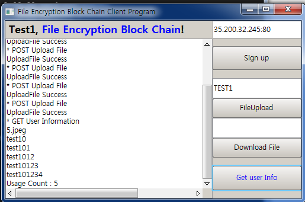

# FileEncryptionBlockChain
파일기반 암호화, 무결성 증명 기능을 제공하는 블럭체인입니다.

9조 - 김휘건, 안지석, 양채훈
-저장소 구성

ClientBin  : 클라이언트 프로그램 소스코드, 실행파일, 샘플 파일, 컴파일 하려면 nana, boost, crypto++ 라이브러리 필요

NodeSrc    : 노드 프로그램 소스코드, Makefile 컴파일 하려면 boost, OpenSSL,crypto++ 라이브러리 필요 

# 실행사진

## 1.블록 체인 내용 출력

위 사진은 메모리에 저장중인 블록체인의 내용을 출력한 것이다. 상단에 표시된 "BufferList"는 채굴 대기중인 파일 해쉬값들이다 현제는 하나의 파일 해쉬가 들어가 있으며 5개 단위로 채굴을 수행하게 된다. 계속해서 "blockchain" 는 이미 채굴이 완료되어 블록체인에 들어가있는 파일 해쉬값들을 출력하고 있다. 위 정보는 메모리에 저장되어 있는 블록체인 만을 출력한것이며, 메모리에 저장할 수 있는 블록의 수는 동적으로 설정 가능하다. 해쉬로는 SHA256을 사용한다.

## 2. 파일 업로드 +채굴 + 블록 전파 + 긴 블록체인 선호 정책

위 사진은 블록체인 망의 노드를 대상으로 다섯 번의 파일 업로드 요청을 보낸 것이다. 파일 해쉬가 다섯 개가 입력됨에 따라 망에 참여중인 모든 노드는 해쉬를 계산하게 되고 먼저 난스값을 발견한 노드는 블록을 만들어 전파하게 된다. 위의 사진의 경우에는 동시에 난스값이 발견된 경우이고 이 경우 두 노드는 독자적으로 서로 다른 블록체인을 구성하게 된다. 또한 전파한 블록체인은 긴 블록 선호 정책에 따라 반영되지 않고 폐기된다. ( 이미 두 노드가 블록을 블록체인에 추가했으므로 전파한 블록체인과 길이 차이는 없다. 따라서 더 긴 블록체인만을 반영하는 긴 블록선호 정책에 위배되므로 폐기한다.) 파일 업로드 횟수는 사용자 별로 제한되어 있으며 채굴 보상을 통해 증가시킬 수 있다.

## 3. 노드 접속

위 사진은 좌측의 노드1번에 우측의 노드2번이 접속하는 상황으로 노드1이 승인한다면 노드2는 블록체인과 메타데이터를 다운로드받고 블록체인 망에 참여하게 된다.

## 4. 파일에 저장된 블록체인

위 사진은 메모리가 아닌 파일에 저장되어 있는 블록체인의 블록들을 출력한 것이다. 메모리에  채굴된 블록들이 일정량을 넘어가면 파일로 저장하게된다. 포맷은 라인별로 다음과 같다. 1.블록인덱스, 2.이전 블록 해쉬, 3.현재 블록 해쉬, 4.난스값, 5.다섯개의 파일해쉬값

## 5. 사용자 인증 절차

블록체인의 파일 업로드, 다운로드 기능을 사용하려면 클라이언트 프로그램을 사용해 인증 절차를 거쳐야 한다. 인증 절차는 클라이언트에서 임의의 노드로 인증 요청을 보내면 노드는 이를 전파해 망의 모든 노드가 이를 승인해야 인증이 완료되는 형태이다. 위의 사진의 경우 랜덤으로 생성된 Client ID인 "raZIxA==" 라는 사용자가 35.200.32.245:80 이라는 노드를 대상으로 인증 요청을 보내고 노드는 이를 승인하여 사진의 하단에 raZIxA== 라는 사용자가 블록체인 망에 등록되었음을 확인할 수 있다.

## 6. 암호화 되어 저장되어있는 파일

위의 사진은 블록체인 망의 임의의 노드에 저장되었는 어떤 사용자의 어떤 파일을 출력한 것이다. 파일의 내용은 클라이언트 프로그램에서 AES로 암호화 된후 Base64인코딩 과정을 거쳐 임의의 노드의 파일에 저장된다. 

## 7. 파일 다운로드

위 사진은 클라이언 프로그램에서 5.jpeg라는 심볼로 저장된 파일을 다운로드 요청하는 모습이다. 블록체인 네트워크는 이에 해당하는 파일을 블록체인에 저장된 파일해쉬를 통해 무결성 검사를 거친후 이를 클라이언트 프로그램으로 전송해준다. 이 과정에서 해쉬를 통한 무결성 검사는 모든 노드가 수행한다. 만약 해쉬가 불일치 할 경우 원본 파일은 폐기하고 백업파일을 가지고 다시 인증 과정을 수행한다. 모든 백업파일이 전부 무결성 검사에 실패할 경우 해당 파일 다운로드 요청은 실패한다. 위 사진에서는 파일을 다운로드 받은후 Base64로 디코딩, AES로 복호화를 수행하고 클라이언트 프로그램에 저장되어있는 파일 원본의 경로, 파일이름을 가지고 파일을 저장한다.

## 8. 사용자 정보 조회

1.노드

위 사진은 노드 프로그램에서 UserInfoList 라는 자료구조를 출력한 것이다. 이 자료구조는 사용자와 사용자가 저장한 파일에 대한 정보를 모두 기록 하고있는 메타데이터이다. 

2.클라이언트

클라이언트 프로그램에서는 “Get user Info” 라는 버튼을 통해 사용자 정보를 조회할 수 있다. 

